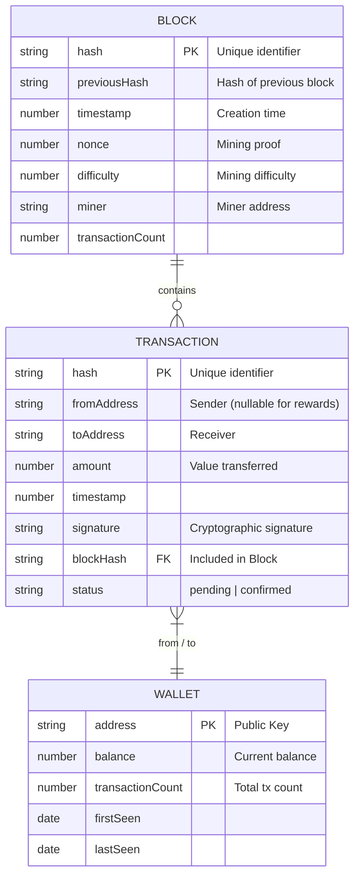
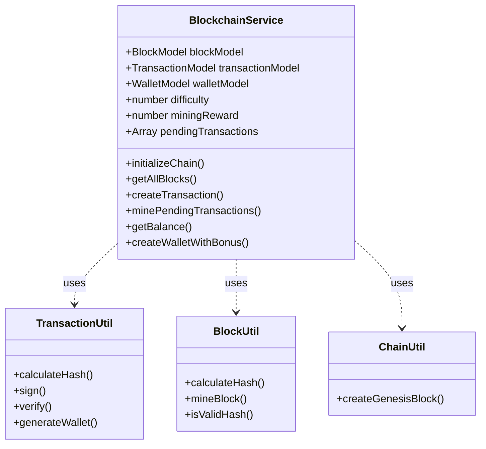

# Lemon Blockchain Explorer - Project Documentation & Tutorial

## 1. Project Overview
Lemon Blockchain Explorer is a full-stack blockchain simulation and explorer application. It allows users to simulate blockchain activities such as mining blocks, creating transactions, and generating wallets, while providing a visual interface to explore the blockchain's history.

---

## 2. OOAD Diagrams (Object-Oriented Analysis and Design)

### 2.1 Database Schema Diagram (ER Diagram)
The project uses MongoDB with three main collections: `Blocks`, `Transactions`, and `Wallets`.



### 2.2 Class Diagram
The core logic resides in the `BlockchainService` and utility classes.



---

## 3. Project Structure
The project follows a standard split-repo structure with `backend` (NestJS) and `frontend` (Next.js).

```
BlockChain/
├── backend/                 # NestJS Server (API & Logic)
│   ├── src/
│   │   ├── blockchain/      # Core Blockchain Logic
│   │   │   ├── blockchain.service.js
│   │   │   ├── blockchain.utils.js
│   │   │   └── schemas.js   # Mongoose Schemas
│   │   ├── controllers/     # API Endpoints
│   │   │   ├── blocks.controller.js
│   │   │   ├── transactions.controller.js
│   │   │   ├── addresses.controller.js
│   │   │   └── mining.controller.js
│   │   └── app.module.js    # Root Module
│   ├── index.js             # Entry Point
│   └── .env                 # Config (MongoDB URI)
│
├── frontend/                # Next.js Client (UI)
│   ├── src/
│   │   └── app/
│   │       ├── layout.js    # Global Layout (Navbar/Footer)
│   │       ├── page.js      # Home Page (Stats, Lists)
│   │       ├── blocks/      # Blocks List & Detail
│   │       ├── tx/          # Transaction List & Detail
│   │       ├── address/     # Address Detail
│   │       └── trade/       # Wallet & Trade UI
│   └── public/              # Static Assets
└── README.md
```

---

## 4. How It Works (Workflow)

1.  **Initialization**:
    *   When the backend starts, `BlockchainService` checks if the database is empty.
    *   If empty, it creates a **Genesis Block** (the first block) automatically.

2.  **Wallet Creation**:
    *   Users generate a wallet keypair (Public Key & Private Key) via Elliptic Curve Cryptography (`secp256k1`).
    *   **Bonus**: The system immediately credits the new address with **1000 LEMON** in the database.

3.  **Transactions**:
    *   A user creates a transaction entering `From Address`, `To Address`, `Amount`, and signing with their `Private Key`.
    *   The backend validates the signature and checks if the sender has enough `balance`.
    *   Valid transactions are added to `pendingTransactions`.

4.  **Mining**:
    *   A "miner" (user or auto-process) calls the mining endpoint.
    *   The system bundles all `pendingTransactions` into a new **Block**.
    *   It performs "Proof of Work" (finding a hash starting with `00...`).
    *   Once a valid hash is found, the block is saved to MongoDB.
    *   **Reward**: The miner receives **10 LEMON** as a reward.

5.  **Data Persistence**:
    *   All Blocks, Transactions, and Wallet states are stored in **MongoDB**. This ensures data is not lost when the server restarts.

---

## 5. User Tutorial (How to Use)

Welcome to **Lemon Explorer**! Here is a simple guide for beginners.

### Step 1: Create a Wallet
1.  Go to the **"Trade & Wallet"** page from the top menu.
2.  Click the blue **"Generate Wallet"** button.
3.  **Success!** You will see your new:
    *   **Public Key (Address)**: Share this to receive money.
    *   **Private Key**: **KEEP THIS SECRET!** You need it to send money.
    *   **Bonus**: You just got **1000 LEMON** coins for free!

### Step 2: Check Your Balance
*   **Auto-Check**: Immediately after generating a wallet, check the **"Check Balance"** section below. Your address is auto-filled. Click **"Check"** to see your 1000 LEMON.
*   **Manual Check**: Paste any wallet address into the box and click "Check" to see its current balance.

### Step 3: Send Coins (Make a Transaction)
1.  On the **Trade** page, go to the **"Create Transaction"** form on the right.
2.  **From Address**: Paste your Public Key.
3.  **Private Key**: Paste your Private Key (to prove it's you).
4.  **To Address**: Paste the address of the person you want to pay.
    *   *Tip: You can generate a second wallet to send money to yourself for testing!*
5.  **Amount**: Enter (e.g., 50).
6.  Click **"Send Coins"**.

### Step 4: Explore
*   **Home Page**: See the latest blocks and transactions updating in real-time.
*   **Blocks**: View the history of all blocks mined.
*   **Transactions**: See a list of all payments ever made.
*   **Address Lookup**: Click on any address hash to see its full history and stats.

### Step 5: Mining (Advanced)
*   Currently, the system mines a block **automatically** whenever you send a transaction to ensure it gets confirmed instantly.
*   In a real blockchain, you would run a mining node to secure the network and earn the **10 LEMON** reward!
